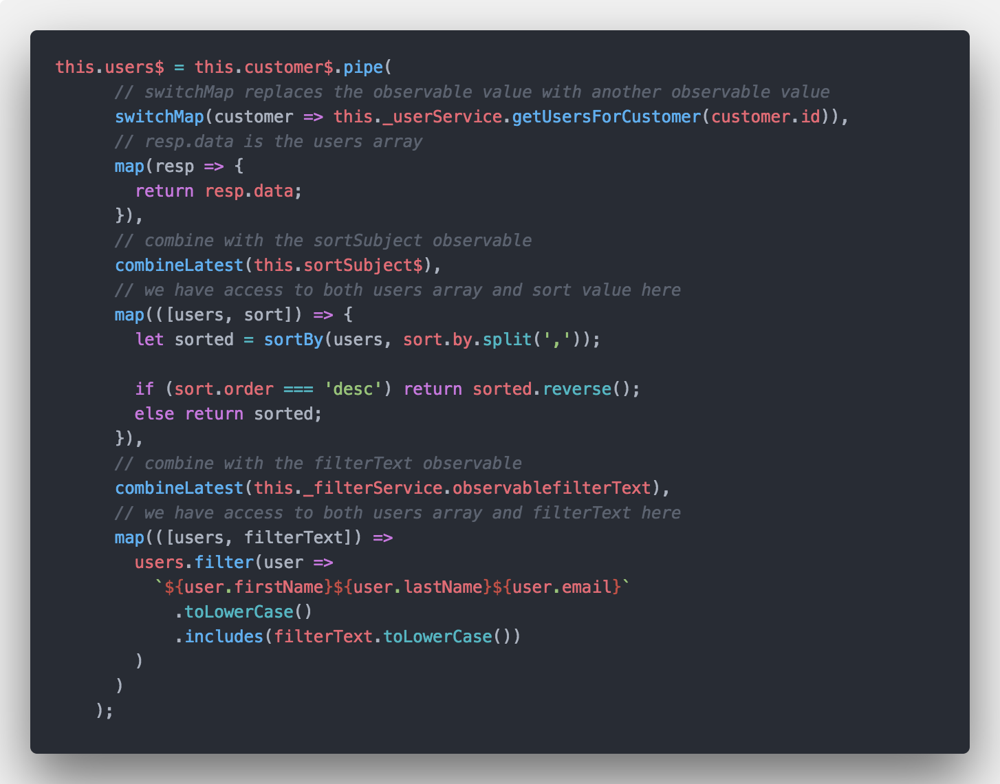

# Operators

## combineLatest

Why Use combineLatest?

This operator is best used when you have multiple, long-lived observables that rely on eachother for some calculation or determination. Basic examples of this can be seen in example three, where events from multiple buttons are being combined to produce a count of each and an overall total, or a calculation of BMI from the RxJS documentation.

Be aware that combineLatest will not emit an initial value until each observable emits at least one value. This is the same behavior as withLatestFrom and can be a gotcha as there will be no output and no error but one (or more) of your inner observables is likely not functioning as intended, or a subscription is late.

## map

Why Use Map?

This operator is used to apply projection with each value from source.

Explanation Here..... bla blah blah

## pipe

## switchMap
